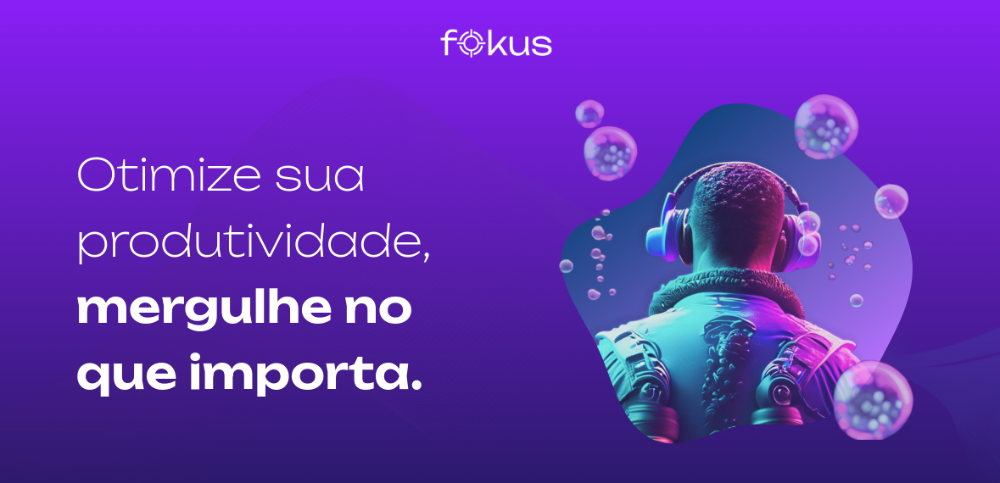
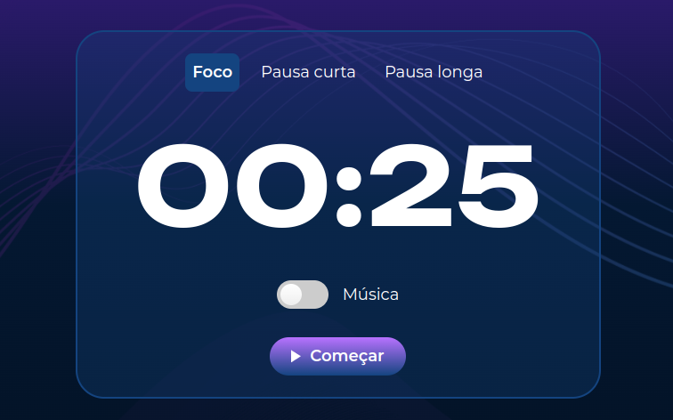
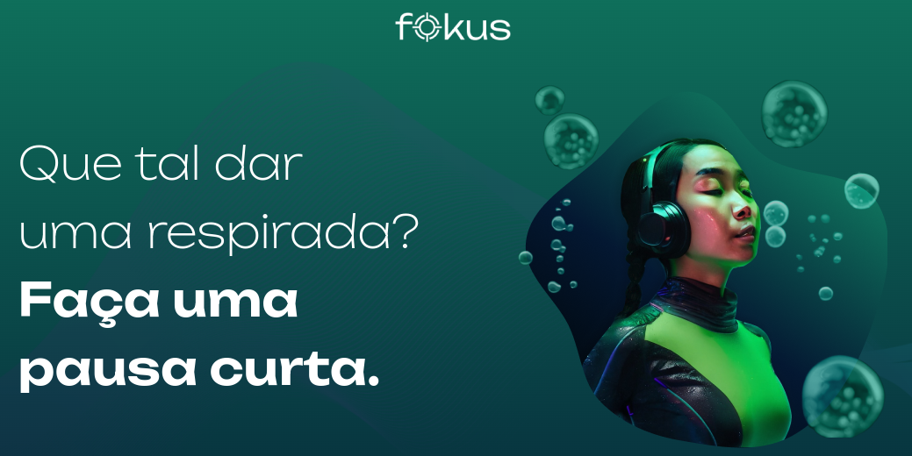
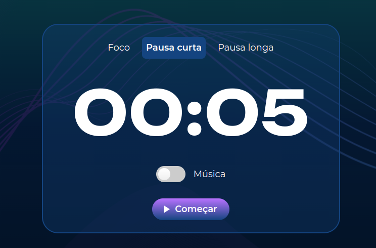
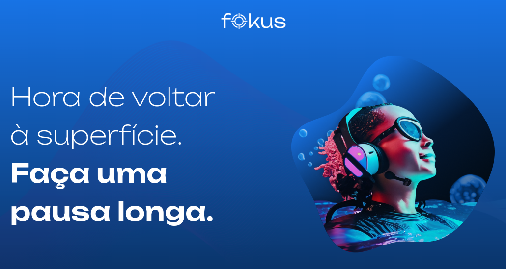
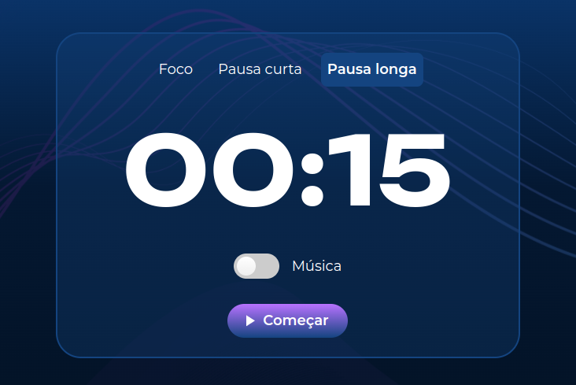
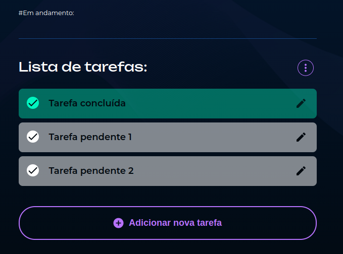

## ⏱️ Fokus

O Fokus é uma aplicação estilo **Pomodoro** que ajuda no gerenciamento do tempo durante os estudos. O usuário pode escolher entre três modos: **foco (25 min), pausa curta (5 min) e pausa longa (15 min)**. Além disso, é possível **adicionar tarefas** e selecionar qual será realizada durante o período de concentração.

 

## 🚀 Sobre o Projeto

Este projeto foi desenvolvido durante o curso da Alura:

* "JavaScript: explorando a manipulação de elementos e da localStorage"

O Fokus é uma aplicação interativa que permitiu conhecer mais sobre a **manipulação do DOM, eventos do usuário e persistência de dados com localStorage**. Foi uma excelente oportunidade para aplicar conhecimentos fundamentais de JavaScript na prática, estruturando uma aplicação real e funcional para melhorar a experiência da pessoa usuária.

## 📚 Objetivos do Curso

* Identificar e utilizar seletores CSS para interagir com elementos HTML através do JavaScript;
* Aplicar conhecimentos de JavaScript para manipular o **DOM**;
* Gerenciar eventos do usuário, como cliques ou envios de formulário;
* Resolver problemas relacionados à gestão de estado em aplicações web, utilizando **armazenamento local e manipulação de array**;
* Criar interfaces interativas utilizando elementos dinâmicos e eventos para melhorar a experiência do usuário;
* Avaliar e implementar estratégias eficientes para a persistência de dados no navegador do cliente através do **LocalStorage**;
* Projetar uma aplicação web funcional que emprega práticas de armazenamento e recuperação de dados para persistência de estado entre sessões.

## 🛠️ Tecnologias Utilizadas

## 🖼️ Visualização do Projeto

Uma prévia das principais funcionalidades do **Fokus**:

**🌐 Acesse o Projeto Online**

O projeto está disponível para visualização na **Vercel**. Clique no link abaixo para acessar:

**🍅 Foco**

Interface inicial com o temporizador de foco de 25 minutos.

**🌿 Pausas Curtas**

Visual diferenciado para pausas curtas, com alterações de cores e mensagens.

**🌿 Pausas Longas**

Visual diferenciado para pausas longas, com alterações de cores e mensagens.

**✅ Seleção de Tarefas**

Lista de tarefas criadas com destaque para a tarefa em execução.

